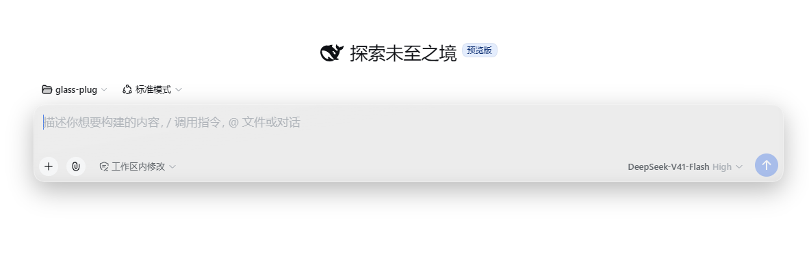
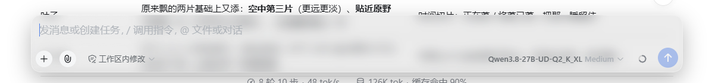

# dsh-composer-glass

Turns the DSH composer into a **single uniformly translucent frosted-glass pane**,
with an on/off switch in Settings → General.





## The switch


## Install

```sh
dsh plugin --profile web add dsh-composer-glass
```

Restart DSH, then enable it under **Settings → General**.

## Upgrade

```sh
dsh plugin --profile web add dsh-composer-glass@latest
```

## Uninstall

```sh
dsh plugin --profile web remove dsh-composer-glass
```

> On Windows, if you clean up leftovers by hand, just delete
> `node_modules\dsh-composer-glass`.

---

## Notes

The switch resets on page reload — persisting it needs a Host-side settings
namespace, which is left as a follow-up change.

This plugin is a **material**, not a refractor. The composer sits over flat colour,
so refracting it produces no visible change; the reasoning and the measurements
are in [docs/WHY-NOT-REFRACTION.md](docs/WHY-NOT-REFRACTION.md).

Development and publishing: [docs/RELEASING.md](docs/RELEASING.md).
Chinese docs: [README.md](README.md).

## License

MIT
