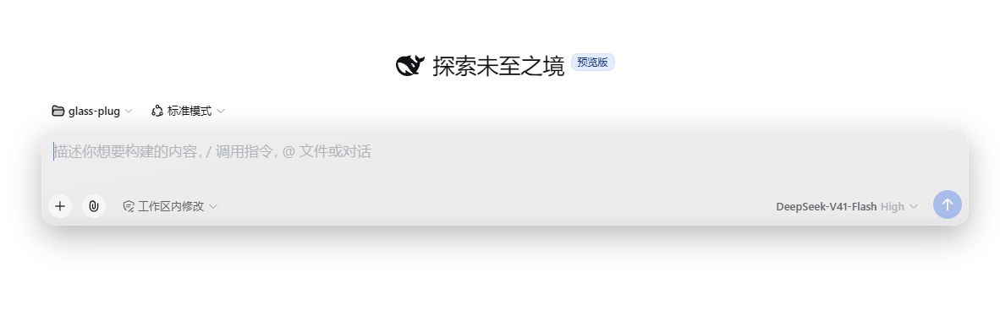
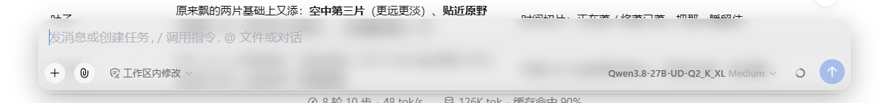
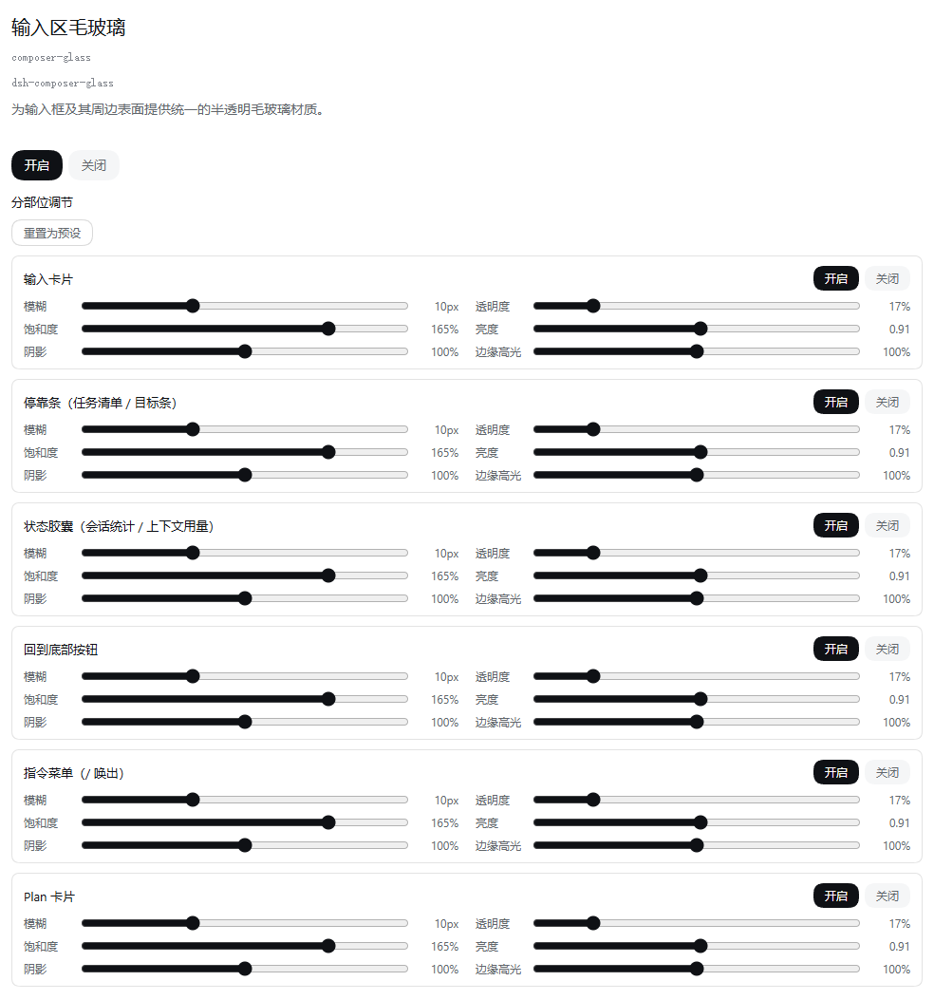

# 🧊 dsh-composer-glass

**把 DSH 的输入区变成一整块均匀半透明的毛玻璃**

开关与分部位调节面板位于 插件面板 → 输入区毛玻璃 → 配置

**中文** | [English](README.en.md)

***

> ⚠️ **DSH 0.1.7-rc.1 经过巨大变动，本插件仅 v0.3.0 以上版本适配。**

## 📸 效果预览

**🟢 开始会话**

**💬 会话中**

**⚙️ 插件 → 输入区毛玻璃 → 配置**

## ✨ 特性

- 🧊 输入框整体呈现**均匀半透明的毛玻璃材质**，而非局部磨砂
- 🧩 同一材质覆盖输入框、其上的**任务清单**与**目标条**、**回到底部** 悬浮按钮、底部把**会话统计**与 **Token 用量** 合成一枚的玻璃胶囊、**`/` 指令菜单**，以及转录中的 **Plan 卡片**
- 🎛️ **分部位调节**：六组表面各自独立开关，每组配 **模糊 / 透明度 / 饱和度 / 亮度 / 阴影 / 边缘高光** 六条滑杆——拖动**实时预览**，松手即**持久保存**，关闭某组立即还原该组原貌
- 🔄 **重置为预设** 一键恢复出厂材质；亮色 / 暗色主题分别调色，跟随主题自动切换

## 🚀 快速开始

### 安装

**DSH内置插件管理器（推荐）**：侧边栏 **插件 → 添加插件**，输入下表任意一种地址 → 安装 → 启用。

**命令行**：`dsh plugin --profile web add "<地址>"`（升级 = 重新执行同一条命令）

| 地址形式 | 说明 |
| :- | :- |
| `dsh-composer-glass` | 包名。⚠️ 新版发布后约 24 小时内装到的仍是上一版，见下方提示 |
| `D:\path\to\dsh-composer-glass` | 本地文件夹。link 活链，改源码刷新即生效，开发调试首选 |
| `D:\path\to\dsh-composer-glass-0.3.0.tgz` | releases .tgz 包 |
| `https://github.com/Lbunc/dsh-composer-glass` | GitHub 仓库。装远程最新推送，可能不稳定 |

### 启用

0.1.7-rc.1 之前的版本仍然需要重启 DSH，侧边栏 **插件 → 输入区毛玻璃 → 配置** 打开开关，每块表面都可在配置卡单独调节。

### 卸载

- **插件管理器**：插件行上的 **卸载** 按钮
- **命令行**：`dsh plugin --profile web remove dsh-composer-glass`

> [!TIP]
> ⏳ **显示的版本 ≠ 实际安装的版本**：插件管理器卡片显示的「最新版 0.3.0」来自 registry 元数据，不过滤；实际安装由 pnpm 解析，供应链冷却机制（`minimumReleaseAge`）会拦下发布不满 24 小时的新版本、静默装上一版——于是出现「显示 0.3.0、装的是 0.2.0」。这不是 bug：等满 24 小时即可，或改用上表的文件夹路径 / tgz / GitHub 方式立即体验新版。

> [!NOTE]
> - 🧹 **卸载会留下配置残留**：开关与滑杆值写在 profile 的 `cordis.patch.yml` 的 `composer-glass` 段，`dsh plugin remove` **不会**删除它；要彻底清理请手动删除该段。
> - 🪟 Windows 上如果还留着 junction，删掉 `node_modules\dsh-composer-glass` 即可。

## 📄 许可

[MIT](LICENSE)

