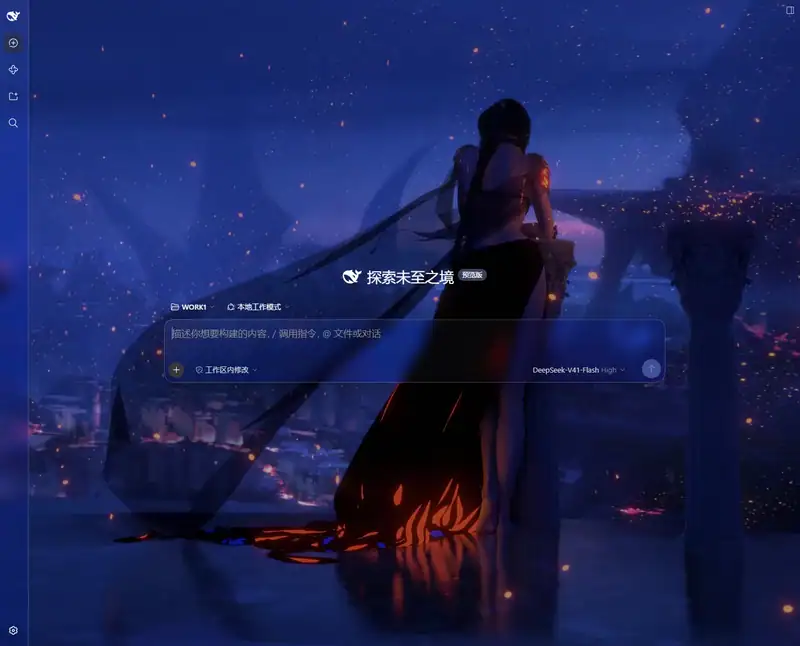
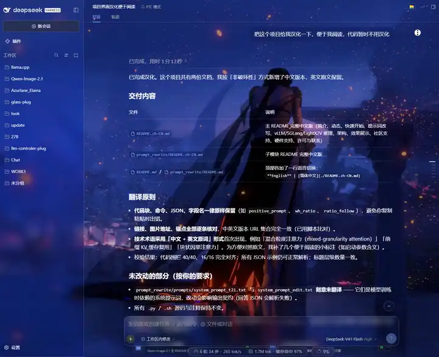

# 🧊 dsh-composer-glass

**毛玻璃动态壁纸 —— 给 DSH 对话界面一层均匀的毛玻璃，底层铺一张壁纸或循环视频**

侧边栏 插件 → 毛玻璃动态壁纸 → 配置

**中文** | [English](README.en.md)

***

## 演示

**开始会话**

**会话正文**

## 特性

- **一层均匀毛玻璃**：输入卡片、任务清单、目标条、`/` 指令菜单、Plan 卡片、状态胶囊（会话统计 + 上下文用量）、回到底部按钮、侧边栏共用同一套材质，而非局部磨砂
- **动态壁纸**：本机图片或循环视频铺在界面底层；新会话胶囊、用户气泡、代码块、行内代码、文件引用卡、提问与审批弹窗、思维链展开行、插件页等白色表面自动玻璃化，壁纸不再被色块遮挡
- **分部位调节**：7 组表面独立开关，每组 6 条滑杆——拖动实时预览，松手持久保存，关闭某组立即还原该组原貌
- **壁纸控制**：填充方式（铺满 / 完整显示）+ 双向调暗调亮滑杆（向左压暗、向右提亮，深色 / 浅色主题都可用）
- **一键重置**为出厂预设；亮色 / 暗色主题分别调色，跟随主题自动切换

## 配置面板

**毛玻璃总开关**：全局启停，关闭即整体还原原生外观。

**壁纸**：

| 设置项 | 说明 |
| :- | :- |
| 显示壁纸 | 图片（jpg / png / webp / gif / avif / bmp / svg）或视频（mp4 / webm / mov / mkv 等），视频自动循环、静音播放 |
| 文件路径 | 本机绝对路径，由宿主读取，不进入网络请求；**添加路径后刷新浏览器生效** |
| 填充方式 | 铺满（cover）/ 完整显示（contain） |
| 调暗 / 调亮 | −100 至 +100：负值叠加黑色遮罩，正值叠加白色遮罩 |

**分部位调节**（7 组，每组独立开关 + 6 条滑杆）：

| 分组 | 覆盖表面 |
| :- | :- |
| 输入卡片 | 底部输入框整卡及其磨砂底衬 |
| 浮动部件 | 任务清单、目标条、`/` 指令菜单、Plan 卡片 |
| 状态胶囊 | 会话统计 + 上下文用量胶囊 |
| 回到底部按钮 | 转录区右下悬浮按钮 |
| 侧边栏 | 左侧栏整列 |
| 内容表面 | 壁纸上的内容表面（见特性第二条） |
| 弹窗卡片 | 权限审批卡、提问 / 选项 / 回答气泡 |

每组滑杆：

| 滑杆 | 范围 | 预设 |
| :- | :- | :- |
| 模糊 | 0 – 30 px | 10 |
| 透明度 | 0 – 100 % | 17 |
| 饱和度 | 50 – 200 % | 165 |
| 亮度 | 50 – 130 % | 91 |
| 阴影 | 0 – 200 % | 100 |
| 边缘高光 | 0 – 200 % | 100 |

> 个别组的阴影出厂值不同：输入卡片 55，侧边栏、内容表面、弹窗卡片 0。**重置为预设**按钮一键恢复上表数值。

## 快速开始

### 安装

**DSH 内置插件管理器（推荐）**：侧边栏 插件 → 添加插件，输入下表任意一种地址 → 安装 → 启用。

**命令行**：`dsh plugin --profile web add "<地址>"`（升级 = 重新执行同一条命令）

| 地址形式 | 说明 |
| :- | :- |
| `dsh-composer-glass` | 包名。新版发布后约 24 小时内装到的仍是上一版，见下方提示 |
| `D:\path\to\dsh-composer-glass` | 本地文件夹。link 活链，改源码刷新即生效，开发调试首选 |
| `D:\path\to\dsh-composer-glass-<版本>.tgz` | releases 页的 .tgz 包 |
| `https://github.com/Lbunc/dsh-composer-glass` | GitHub 仓库。装远程最新推送，可能不稳定 |

### 启用

侧边栏 插件 → 毛玻璃动态壁纸：行上开关控制插件启停，配置卡内调节材质与壁纸。所有调节即时生效，无需重启 DSH；**更换壁纸路径后刷新浏览器**。

### 卸载

- **插件管理器**：插件行上的 **卸载** 按钮
- **命令行**：`dsh plugin --profile web remove dsh-composer-glass`

> [!TIP]
> ⏳ **显示的版本 ≠ 实际安装的版本**：插件管理器卡片显示的「最新版」来自 registry 元数据，不过滤冷却期；实际安装由 pnpm 解析，供应链冷却机制（`minimumReleaseAge`）会拦下发布不满 24 小时的新版本、静默装上一版——出现「显示新版、装的是旧版」即此原因。这不是 bug：等满 24 小时即可，或改用上表的文件夹路径 / tgz / GitHub 方式立即体验新版。

> [!NOTE]
> - 卸载会留下配置残留：开关与滑杆值写在 profile 的 `cordis.patch.yml` 的 `composer-glass` 段，`dsh plugin remove` **不会**删除它；要彻底清理请手动删除该段。
> - Windows 上如果还留着 junction，删掉 `node_modules\dsh-composer-glass` 即可。

## 兼容性

| 项目 | 说明 |
| :- | :- |
| DSH 版本 | ≥ 0.1.7-rc.1（0.2.0-rc.2 实测）；0.1.6 及更早不支持，插件请用 v0.3.0 及以上 |
| 平台 | 毛玻璃：web 与 desktop（Harness）双平台；动态壁纸：当前仅 web 端，desktop 适配计划中 |

## 开发

- 测试：`node --test test/`
- 结构：`lib/index.js` 宿主端（volatile Config、壁纸 HTTP 路由，支持 Range 分段与 ETag 协商）；`lib/client.js` 浏览器端（材质样式与配置卡，纯 HTML 自绘，无 UI 原语依赖）

## 许可

[MIT](LICENSE)

